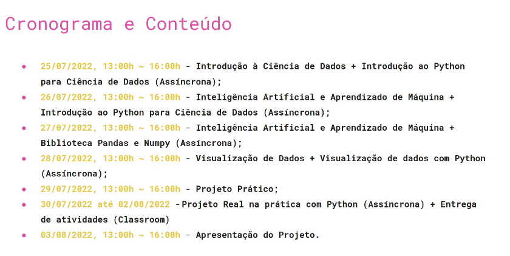

# Aulas e Conteúdos

### Estarei deixando separado as anotações para melhor organização do conteúdo

Intro à Ciência de Dados + Python para Ciência de Dados

# Currículo de um Cientista de Dados
    # Geralmente um profissional multidisciplinar, podendo vir de diversas áreas
    # Possui conhecimentos em:
        - R, Python e SQL (Linguagens de análise e extração de dados)
        - Estatística e AI/Machine Learning
        - Tableu, PowerBI, streamlit, etc… (Tecnologia de visualização de dados e criação de relatórios)
        - Negócios e produtos

# Mercado de Trabalho
    # Setor de varejo/saúde/financeiro/marketing
        - 9 posição em alta em 2022
        - 60 mil vagas não ocupadas em 2021
        - Média salárial de 6k-9k
    
# Intro a Ciência de Dados

    # Combinação de cic, estat e mat que pode ser usada interdisciplinarmente
    # Processo de extrair info através de dados
    # Identificar tendências
    # Dados → Análise → Decisão → Ação
        - O que aconteceu?
        - Por que aconteceu?
        - Acontecerá novamente?
        - O que deve ser feito?

    
# Tipos de Modelo
    # Descrição de fenômenos do mundo real e digital
    # Geração de valor a negócios
    # Automatizar processos para operações de:
        - Inferência/Predição
        - Classificação
        - Agrupamento
        - Recomendação
    # Modelos de Classificação
        - Modelo supervisionado, rotulado manualmente
    # Modelos de Agrupamento/Clusterização
        - Enviar um conjunto de características para a máquina para ela atribuir à um modelo específico
        - Agrupa bancos de dados com características comuns
        - Eu, como humano, posso rotular esses grupos que são agrupados
    # Modelos de Recomendação
        - Modelo colaborativo → Renner, Netflix, Amazon
        - Modelo pessoal → Netflix, Instagram, Tiktok

# Etapas de Geração de um Modelo

    # Entrada de Dados
        - Separados entre treinamento e teste, um com ajuda humana e outro para testar a capacidade da máquina
    # Coleta/Organização
        - Dados podem vir de múltiplas fontes
        - Tipicamente desorganizados
        - A combinação de múltiplas fontes de dados tem como objetivo criar modelos mais acurados
    # Tratamento
        - Descarte
            - Dados em brancco
            - Dados de má qualidade
            - Anomalias
        - Preenchimento de dados faltantes
            - Interpolação
            - Substituição por valores de média, moda ou mediana
        - Transformação
            - Normalização
            - Codificação
            - Engenharia de características
    # Concepção do modelo
        - Separação da base de dados entre teste e treinamento
            - No treinamento a gente dá o rótulo das características, ou seja, o resultado com base na entrada
        - Escolha do modelo conforme a aplicação:
            - Classificação ou Predição
                - KNN
                - ARIMA
                - Long-Short Term Memory
                - Neural networks
                - …
            - Agrupamento
                - K-means
                - Mean-shift clustering
                - DBSCAN
                - Gaussian Mixture Models
                - …
            - Recomendação
                - Collaborative filtering
                - Content-based filtering
    # Avaliação dos resultados
    # Validação
        - Teste
            - Teste de hipótese (análise do p-valor) e confirmação de tese
            - Validação cruzada
            - Análise de métricas de avaliação
                - Acurácia, precisão, erro médio absoluto
        - Aprovação do resultado por gestores e clientes
    # Implantação
        - Lançamento do modelo em produção
        - Geração de valor ao negócio
        - Monitoramento e aprimoramento contínuo do modelo
# Mãos à obra!
- [https://colab.research.google.com/drive/10mEkJA36tridzPuUlhkZctXeaZ4EvvnZ?usp=sharing](https://colab.research.google.com/drive/10mEkJA36tridzPuUlhkZctXeaZ4EvvnZ?usp=sharing)

 