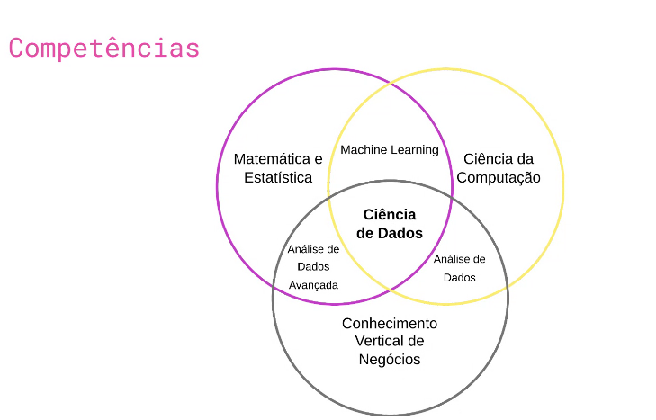
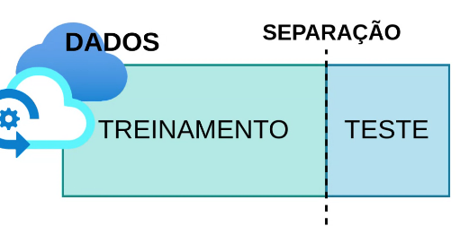
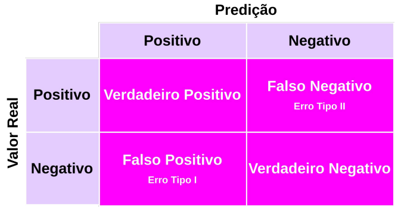
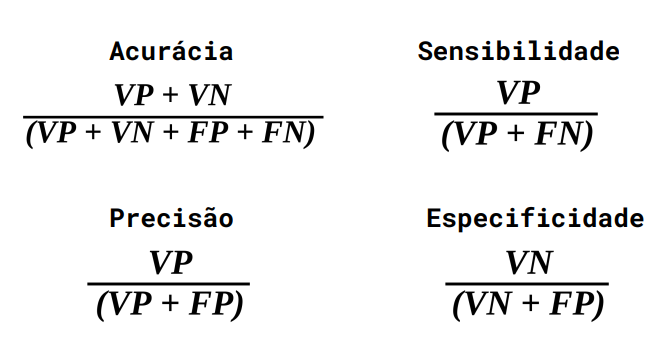
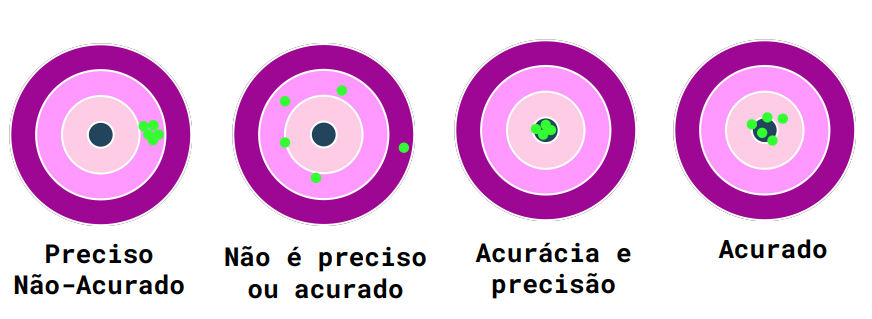
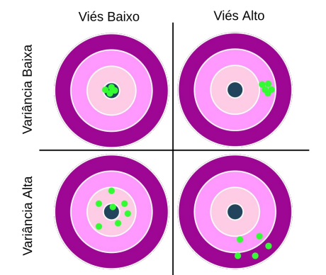
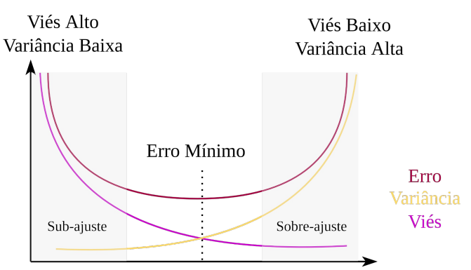
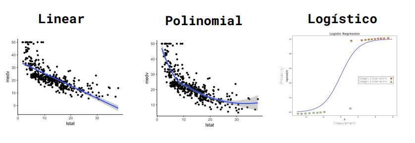

# Aulas e Conteúdos

### Estarei deixando separado as anotações para melhor organização do conteúdo

Intro à Ciência de Dados + Python para Ciência de Dados

# Currículo de um Cientista de Dados
    # Geralmente um profissional multidisciplinar, podendo vir de diversas áreas
    # Possui conhecimentos em:
        - R, Python e SQL (Linguagens de análise e extração de dados)
        - Estatística e AI/Machine Learning
        - Tableu, PowerBI, streamlit, etc… (Tecnologia de visualização de dados e criação de relatórios)
        - Negócios e produtos

# Mercado de Trabalho
    # Setor de varejo/saúde/financeiro/marketing
        - 9 posição em alta em 2022
        - 60 mil vagas não ocupadas em 2021
        - Média salárial de 6k-9k

# Intro a Ciência de Dados

    # Combinação de cic, estat e mat que pode ser usada interdisciplinarmente
    # Processo de extrair info através de dados
    # Identificar tendências
    # Dados → Análise → Decisão → Ação
        - O que aconteceu?
        - Por que aconteceu?
        - Acontecerá novamente?
        - O que deve ser feito?

# Tipos de Modelo
    # Descrição de fenômenos do mundo real e digital
    # Geração de valor a negócios
    # Automatizar processos para operações de:
        - Inferência/Predição
        - Classificação
        - Agrupamento
        - Recomendação
    # Modelos de Classificação
        - Modelo supervisionado, rotulado manualmente
    # Modelos de Agrupamento/Clusterização
        - Enviar um conjunto de características para a máquina para ela atribuir à um modelo específico
        - Agrupa bancos de dados com características comuns
        - Eu, como humano, posso rotular esses grupos que são agrupados
    # Modelos de Recomendação
        - Modelo colaborativo → Renner, Netflix, Amazon
        - Modelo pessoal → Netflix, Instagram, Tiktok

# Etapas de Geração de um Modelo

    # Entrada de Dados
        - Separados entre treinamento e teste, um com ajuda humana e outro para testar a capacidade da máquina
    # Coleta/Organização
        - Dados podem vir de múltiplas fontes
        - Tipicamente desorganizados
        - A combinação de múltiplas fontes de dados tem como objetivo criar modelos mais acurados
    # Tratamento
        - Descarte
            - Dados em brancco
            - Dados de má qualidade
            - Anomalias
        - Preenchimento de dados faltantes
            - Interpolação
            - Substituição por valores de média, moda ou mediana
        - Transformação
            - Normalização
            - Codificação
            - Engenharia de características
    # Concepção do modelo
        - Separação da base de dados entre teste e treinamento
            - No treinamento a gente dá o rótulo das características, ou seja, o resultado com base na entrada
        - Escolha do modelo conforme a aplicação:
            - Classificação ou Predição
                - KNN
                - ARIMA
                - Long-Short Term Memory
                - Neural networks
                - …
            - Agrupamento
                - K-means
                - Mean-shift clustering
                - DBSCAN
                - Gaussian Mixture Models
                - …
            - Recomendação
                - Collaborative filtering
                - Content-based filtering
    # Avaliação dos resultados
    # Validação
        - Teste
            - Teste de hipótese (análise do p-valor) e confirmação de tese
            - Validação cruzada
            - Análise de métricas de avaliação
                - Acurácia, precisão, erro médio absoluto
        - Aprovação do resultado por gestores e clientes
    # Implantação
        - Lançamento do modelo em produção
        - Geração de valor ao negócio
        - Monitoramento e aprimoramento contínuo do modelo
# Mãos à obra!
- No exercicio1.py estarei tentando realizar um exercicio presente no enunciado que está explícito dentro do próprio código em forma de comentário.

Inteligência Artificial e Aprendizado de Máquina + Introdução ao Python para Ciência de Dados

# Introdução à Inteligência Artificial

## Dividido em 4 definições:
- Pensamento humanizado

    > O fascinante esforço de fazer computadores pensar… Máquinas com mentes, no completo sentido literal. (Haugeland, 1985)
    >

    > A automação de atividades que associamos com pensamento humano, atividades como tomada de decisão, resolução de problema, aprendizado… (Bellman, 1978)
    >
- Pensamento racional

    > É o estudo das faculdades mentais através de modelos computacionais (Charniak e McDermott, 1985)
    >

    > É o estudo da computação que torna possível sentir, racionalizar, e agir. (Winston, 1992)
    >
- Agir humanamente

    > É a arte de construir máquinas que executam funções que demandam
    inteligência, quando executadas por pessoas. (Kurzweil, 1990)
    >

    > É o estudo de como fazer computadores realizarem coisas que, no
    momento, as pessoas fazem de maneira melhor. (Rich and Knight, 1991)
    >
- Agir racionalmente

    > Inteligência computacional é o estudo da criação de agentes
    inteligentes.” (Poole et al., 1998)
    >

    > IA se preocupa com comportamento inteligente em artefatos. (Nilsson, 1998)

# Teste de Turing
    # Agir humanamente da máquina
    # Um computador é aprovado no teste de Turing se um humano, após fazer uma série de perguntas, não sabe distinguir se as respostas são de uma máquina ou de outro humano.
    # Para uma máquina passar nesse teste, demandaria:
        - Processamento de linguagem natural, ou seja, se comunicar em algum idioma
        - Representação de conhecimento, ou seja, armazenar o que vê e ouve
        - Raciocínio automático, ou seja, usar o conhecimento armazenado para responder perguntas e chegar à conclusões
        - Aprendizado de máquina, que é adaptar-se à novas circunstâncias, identificar padrões e fazer generalizações
# Atlas <3
    # Boston Dynamics
    # Área da robótica
    # OBS.: Me lembra muito minha vontade de trabalhar com robótica, reabilitação, exoesqueletos e impulsos elétricos
# Dall-E
    # Rede neural que reproduz imagens por instruções de texto
# Aprendizado de Máquina
    # Sub-área do campo da inteligência artificial
    # Capacidade da máquina de imitar o comportamento inteligente humano
    # Divide-se em:
        - Aprendizado supervisionado (dados rotulados)
        - Aprendizado não-supervisionado (dados não-rotulados)
        - Aprendizado por reforço (tentativa e erro)

# Mãos à obra!

    Utilize os algoritmos K-NN e Árvore de Decisão para classificar pétalas do conjunto de dados Iris

# Métricas de avaliação
    # Matriz de confusão

    # Métricas de avaliação de classificação

    # Diferença entre acurácia e precisão
      - O modelo acurado geralmente acerta o alvo, enquanto o preciso é ter consistência nos resultados

    # Viés e Variância
        - É preferível que o viés (erro) e a variância sejam baixos, para que sejam resultados acurados e com pouco erro mínimo

      - Nesse gráfico, é possível enxergar a relação entre viés e variância

# Análise de Regressão
  - Objetiva gerar modelos matemáticos ajustados a um conjunto de dados
  - O modelo define e prevê padrões no conjunto de dados
  - O melhor modelo é definido de acordo com uma função de erro, a qual deve ser minimizada
  - Tipos comuns de modelos regressivos:
      - Linear
      - Polinomial
      - Logístico (Classificação Binária)

# Modelo de regressão: avaliação de erro
- Funções comuns:
  - Erro médio absoluto (MAE)
  - Erro quadrático médio (MSE)
  - Raiz do erro quadrático médio (RMSE)
  - Erro percentual absoluto médio (MAPE)

